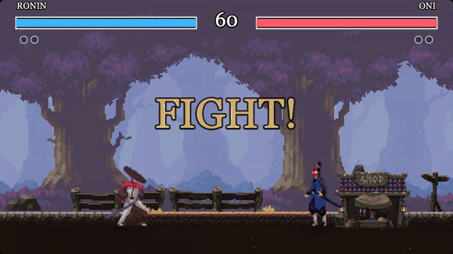
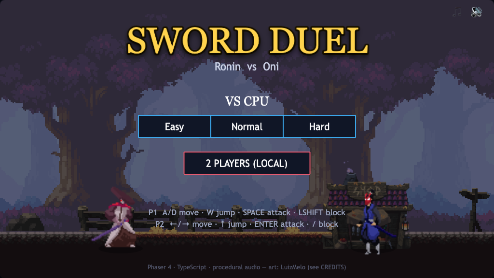
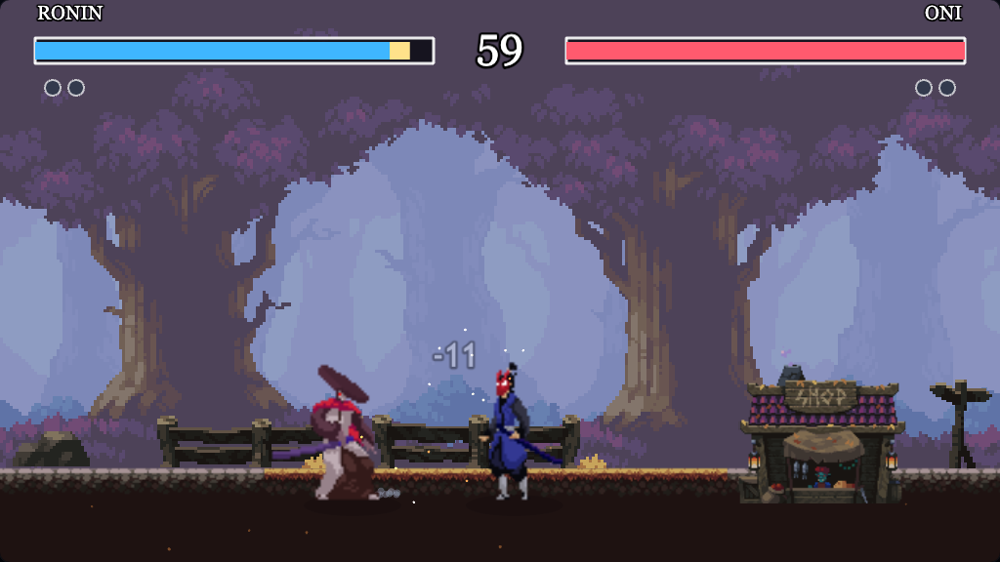
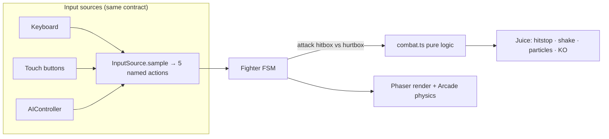

# ⚔️ Sword Duel

**A polished, juice-driven 2D fighting game for the browser — Phaser 4 + TypeScript. Play instantly, no install.**

[**▶ Play now**](https://toshkee.github.io/One-Piece-Sword-Duel/) · Two animated swordfighters, frame-accurate combat, an FSM AI opponent, best-of-three rounds, and a full "game feel" layer (hitstop, screen shake, particles, a cinematic slow-mo KO).



<p align="center">
  
  
</p>

---

## ✨ Highlights

- **Real sprite-sheet animation** — idle / run / jump / fall / two attacks / hurt / death, driven by a per-fighter **finite-state machine**.
- **Frame-accurate combat** — attacks expose a hitbox only on their *active frames*, resolved against the opponent's hurtbox. The collision/damage math is **pure and unit-tested**.
- **Single-player vs an FSM AI** with Easy / Normal / Hard tiers — or **2-player local**.
- **Best-of-three** rounds with intro, KO and match flow.
- **Game feel** layer fired on every connecting hit: ~95 ms **hitstop**, trauma-based **screen shake**, white-silhouette flash, **knockback**, impact **particles**, floating damage numbers, a combo counter, ghost/chip **health bars**, and a cinematic **slow-mo KO** finisher.
- **Procedural audio** — every SFX and the music bed are synthesised at runtime with the Web Audio API (no audio files shipped).
- **Plays on a phone** — on-screen touch controls appear automatically on touch devices.
- **Framerate-independent** — delta-timed movement and a velocity-based jump arc, so it plays the same on a 60 Hz or 144 Hz display.

## 🎮 Controls

| | Move | Jump | Attack | Block |
|---|---|---|---|---|
| **Player 1** | `A` / `D` | `W` | `Space` | `Left Shift` |
| **Player 2** | `←` / `→` | `↑` | `Enter` | `/` |

`Esc` returns to the menu. On the menu, `1` starts a CPU match and `2` starts a 2-player match. On phones, tap the on-screen buttons.

## 🏗️ Architecture

The project is deliberately structured around a **pure rules core** with thin Phaser glue on top, so the combat logic is testable in Node without a browser.



**Scene flow:** `Boot → Preload → Menu → Fight → Result`.

The key design decision is the **input abstraction**: keyboard, touch and AI all reduce to the same five named actions (`left, right, jump, attack, block`), so a `Fighter` cannot tell a human from a bot. That one seam is what makes the AI opponent, local 2-player and mobile controls share a single fighter implementation.

```
src/
├── config/      constants.ts (all tunables) · characters.ts (data-driven roster + frame data)
├── core/        Fighter.ts (FSM sprite) · combat.ts (pure, tested) · input.ts · AIController.ts · types.ts
├── audio/       SoundManager.ts (Web Audio synthesis)
├── ui/          HealthBar.ts (ghost/chip bars)
└── scenes/      Boot · Preload · Menu · Fight · Result
tests/           combat.test.ts (Vitest) · e2e/ (Playwright smoke test)
```

## 🛠️ Tech stack

**Phaser 4** · **TypeScript** (strict) · **Vite** · **Vitest** (unit) · **Playwright** (E2E) · **ESLint + Prettier** · **GitHub Actions** CI/CD → **GitHub Pages**.

## 🚀 Run it locally

```bash
npm install
npm run dev        # http://localhost:5180 (opens automatically)

npm run build      # typecheck + production build to dist/
npm run preview    # serve the production build
npm test           # unit tests (game logic)
npm run test:e2e   # Playwright smoke test (boots the built game)
npm run lint       # eslint
```

Requires Node 20+.

## 🧪 Quality

- **Unit tests** cover the pure combat core — hit detection, block/chip damage, round resolution and match win conditions.
- **Playwright** boots the real built game and asserts it reaches a match with no console errors.
- **CI** (`.github/workflows/deploy.yml`) runs lint → typecheck → test → build on every push, then deploys `main` to GitHub Pages.

## 💡 Design notes — making hits *feel* good

The single biggest lever in combat feel is **hitstop**: freezing both fighters for ~95 ms on a connecting hit (longer on a KO). On top of that, feedback is fired across multiple senses on the *same frame* — visual (flash + particles), spatial (knockback + shake), temporal (the freeze) and audio (a bass-heavy impact). Juice stacks *multiplicatively*: any one of these alone is unconvincing; together they sell the weight of a sword. Whiffs are intentionally left dry so a clean hit reads as an event. (Inspired by Vlambeer's *Art of Screenshake* and Jan Willem Nijman / Martin Jonasson's *Juice it or lose it*.)

## 🔭 Roadmap

- Character-select screen (the roster is already data-driven).
- Blocking depth: parries, super meter, combo routes via input buffering.
- WebRTC P2P online play with a small input delay.

## 📜 History, credits & license

This began as a General Assembly bootcamp project ("One Piece Sword Duel") and was **fully rebuilt** from a vanilla-DOM prototype into this Phaser 4 + TypeScript game, and **re-themed to be IP-clean**. The original version is preserved on the `legacy/one-piece-vanilla` branch.

- **Art:** "Martial Hero" 1 & 2 by **LuizMelo** — see [CREDITS.md](CREDITS.md).
- **Audio:** procedurally generated (no third-party samples).
- **Code:** © 2026 Pavle Tosic — [MIT](LICENSE).
